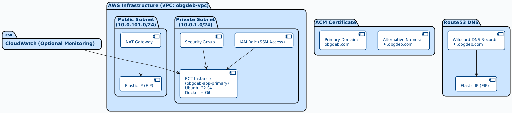

# Task Description:
Deploy a multi-container microservices application using Docker Compose on a single AWS EC2 instance behind Traefik reverse proxy, with HTTPS enabled for all subdomains (*.obgdeb.com), accessible publicly over the internet.

## Detailed Task Breakdown and Required Resources

1. **Networking Setup**  
   - Create a VPC with public and private subnets.  
   - Deploy a NAT Gateway in the public subnet with an Elastic IP to enable internet access for private subnet resources.  
   - Create appropriate Route Tables and Associations so private subnet routes outbound traffic via NAT Gateway.  
   - Configure Security Groups to allow:  
     - Inbound HTTP/HTTPS traffic (ports 80, 443) to the EC2 instance (from anywhere).  
     - Allow necessary ports for Traefik and application containers internally.  
     - SSH/SSM access (if needed).  

2. **Domain and SSL Setup**  
   - Use existing Route53 hosted zone for `obgdeb.com`.  
   - Create a wildcard DNS record `*.obgdeb.com` pointing to the Elastic IP of your NAT Gateway (or public IP of EC2 if applicable).  
   - Provision ACM SSL certificate for:  
     - Primary domain: `obgdeb.com`  
     - SAN (Subject Alternative Name): `*.obgdeb.com`  
   - Validate ACM cert via DNS validation using Route53.  

3. **EC2 Instance Provisioning**  
   - Launch an EC2 instance (e.g., `t3.large`) in the private subnet with:  
     - IAM Role with SSM and CloudWatch permissions.  
     - Security Group configured as above.  
   - Use user_data script to:  
     - Install Docker, Docker Compose, Git.  
     - Clone your GitHub repo (https://github.com/kouamschekina/obg-deployment).  
     - Run `docker compose up -d` to start containers including Traefik.  

4. **Traefik and Docker Compose**  
   - Traefik will act as the reverse proxy on the EC2 instance handling:  
     - HTTPS termination using ACM cert (or use Traefik’s Let's Encrypt if preferred).  
     - Routing traffic based on subdomains `*.obgdeb.com` to corresponding Docker containers/services.  
   - Docker Compose manages all microservice containers, connected via Docker network internally.  

5. **Monitoring and Logging (Optional but Recommended)**  
   - Enable CloudWatch agent on EC2 for metrics and logs collection.  
   - Configure CloudWatch alarms on key metrics (CPU, memory, disk).  

6. **Access and Management**  
   - Use AWS Systems Manager (SSM) for remote instance access, avoiding the need for open SSH ports.  
   - Manage updates and deployments by pushing code changes to GitHub and triggering redeploys via scripts or CI/CD pipeline.  

## Summary of AWS Resources Needed

| Resource Type                 | Purpose                                               |
|------------------------------|-------------------------------------------------------|
| VPC                          | Isolated network space                                |
| Subnets (Public + Private)   | Network segmentation                                  |
| Internet Gateway             | Internet access for public subnet                     |
| NAT Gateway + Elastic IP     | Outbound internet access for private subnet          |
| Route Tables & Associations  | Traffic routing                                       |
| Security Groups              | Firewall rules                                        |
| Route53 Hosted Zone & Record | Domain name resolution, wildcard DNS for subdomains  |
| ACM Certificate              | SSL/TLS for HTTPS on domain and subdomains           |
| EC2 Instance                 | Host for Docker containers                            |
| IAM Role & Instance Profile  | Permissions for SSM, CloudWatch, etc.                 |
| CloudWatch (Optional)        | Monitoring & alerts                                   |
