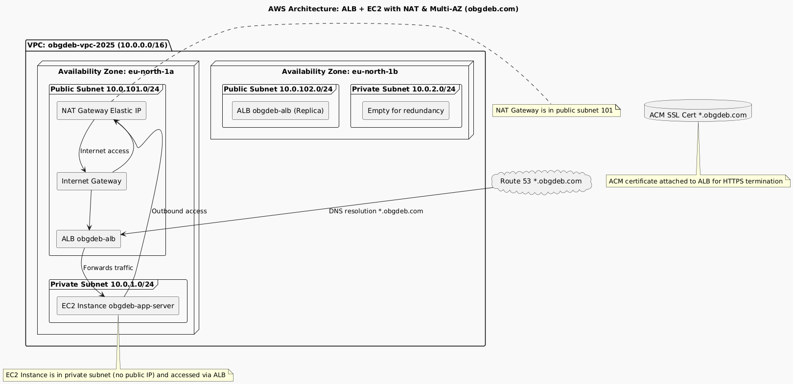

# Task Description:
Deploy a multi-container microservices application using Docker Compose on a single AWS EC2 instance, which is placed in a private subnet behind an Application Load Balancer (ALB). The ALB is the public entry point, with HTTPS enabled for all subdomains (*.obgdeb.com) using an ACM certificate. All public access is routed through the ALB, and DNS records point to the ALB. The EC2 instance is not directly exposed to the internet.

## Deployment Flow and Architecture

1. **Networking Setup**  
   - Create a VPC with public and private subnets in two AZs (eu-north-1a and eu-north-1b).
   - Deploy a NAT Gateway in the public subnet of AZ1 (10.0.101.0/24) with an Elastic IP to enable outbound internet access for private subnet resources.  
   - Application Load Balancer (ALB) is deployed across both public subnets and acts as the public entry point for all traffic.  
   - Private subnet in AZ1 hosts a single EC2 instance running Docker Compose.  
   - Private subnet in AZ2 is currently empty (reserved for future redundancy or scaling).
   - Route tables ensure the private subnet routes outbound traffic via the NAT Gateway.
   - Security Groups:
     - ALB SG allows inbound HTTP/HTTPS (80/443) from anywhere.
     - EC2 SG allows inbound traffic from the ALB SG (port 80 for app traffic).
     - Outbound rules allow all necessary egress (0.0.0.0/0) for updates, SSM, etc.

2. **Domain and SSL Setup**  
   - Use Route53 hosted zone for `obgdeb.com`.
   - Create a wildcard DNS record `*.obgdeb.com` pointing to the ALB (not the EC2 or NAT Gateway).
   - Provision ACM SSL certificate for:
     - Primary domain: `obgdeb.com`
     - SAN: `*.obgdeb.com`
   - Validate ACM cert via DNS validation using Route53.
   - ALB uses the ACM certificate for HTTPS termination.

3. **EC2 Instance Provisioning**  
   - Launch an EC2 instance (t3.large) in the private subnet of eu-north-1a.
   - Attach an IAM Role with SSM and CloudWatch permissions.
   - Security Group allows inbound from ALB only.
   - Use user_data script to:
     - Install Docker, Docker Compose, Git.
     - Clone your GitHub repo (https://github.com/kouamschekina/obg-deployment).
     - Run `docker compose up -d` to start containers including Traefik and all microservices.

4. **Application Load Balancer (ALB) and Traefik**  
   - ALB terminates HTTPS and forwards HTTP traffic to the EC2 instance on port 80.
   - Traefik runs as a reverse proxy inside Docker on the EC2 instance, routing traffic to the appropriate containers/services based on subdomain and path.
   - All public traffic flows: **Internet → Route53 DNS → ALB (HTTPS) → EC2 (private subnet, HTTP) → Traefik → Containers**

5. **Monitoring and Logging**  
   - Enable CloudWatch agent on EC2 for metrics and logs collection.
   - Configure CloudWatch alarms on key metrics (CPU, memory, disk).

6. **Access and Management**  
   - Use AWS Systems Manager (SSM) for remote instance access (no open SSH ports required).
   - Manage updates and deployments by pushing code changes to GitHub and triggering redeploys via scripts or CI/CD pipeline.

## Summary of AWS Resources Needed

| Resource Type                 | Purpose                                               |
|------------------------------|-------------------------------------------------------|
| VPC                          | Isolated network space                                |
| Subnets (Public + Private)   | Network segmentation                                  |
| Internet Gateway             | Internet access for public subnet                     |
| NAT Gateway + Elastic IP     | Outbound internet access for private subnet           |
| Route Tables & Associations  | Traffic routing                                       |
| Security Groups              | Firewall rules                                        |
| Route53 Hosted Zone & Record | Domain name resolution, wildcard DNS for subdomains   |
| ACM Certificate              | SSL/TLS for HTTPS on domain and subdomains            |
| Application Load Balancer    | Public entry point, HTTPS termination, routing        |
| EC2 Instance                 | Host for Docker containers (private subnet)           |
| IAM Role & Instance Profile  | Permissions for SSM, CloudWatch, etc.                 |
| CloudWatch                   | Monitoring & alerts                                   |

## Current Architecture Status

###  **What's Working:**
- **VPC**: Two-AZ setup with public/private subnets in eu-north-1a and eu-north-1b
- **NAT Gateway**: Single NAT Gateway with Elastic IP for private subnet internet access (in AZ1)
- **ALB**: Application Load Balancer with HTTPS termination, spanning both public subnets
- **EC2**: Single t3.large instance in private subnet (AZ1)
- **Security Groups**: Properly configured for ALB → EC2 traffic
- **DNS**: Route53 with wildcard records pointing to ALB
- **SSL**: ACM certificate for domain and subdomains
- **Monitoring**: CloudWatch alarms and metrics
- **IAM**: Proper roles for EC2 instance

## Cost Estimation
For a detailed and up-to-date estimate, use the [AWS Pricing Calculator](https://calculator.aws/#/) and include:
- 1x EC2 (t3.large)
- 1x ALB
- 1x NAT Gateway
- 1x Elastic IP
- Data transfer, Route53, ACM, CloudWatch, etc.